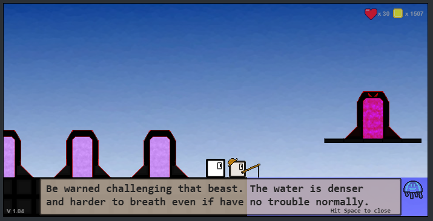

<h1>Block Run Beta</h1>

<a href="https://spencerwie.github.io/Block%20Run/blockRun.html"> Click here to play the lastest version of the game</a>

The original game <em>Block Run</em>, was created as a simple platform game in Python (using pyGame). It was the first "real" game that I've created, because of this things were not done in the most effiecent way. Now I'm doing a new and improved <em>Block Run</em> written in JavaScript using the HTML5 Canvas. 

<h3>How to Play:</h3>
<ul>
	<li><em><strong>Left/Right Arrow keys:</strong></em> Moves player left and right.</li>
	<li><em><strong>Up Arrow key:</strong></em> Jump.</li>
	<li><em><strong>Down Arrow key:</strong></em> Duck.</li>
	<li><em><strong>Shift (Hold):</strong></em> Sprint.</li>
	<li><em><strong>Space:</strong></em> Action (Use Portal/Shop/etc).</li>
  <li><em><strong>C:</strong></em> Change player color if brought, cycles through them going back to the default color.</li>
</ul>

<h3>Future Planned Changes:</h3>
<ul>
  <li>More Bosses 0.9x-1.0x</li>
  <li>New Enemies</li>
  <li>Diamond Store</li>
  <li>New Town Area after beating Big Red</li>
  <li>Ice tiles.</li>
  <li>Title Screen + Intro Tutorial</li>
</ul>  

<h3>Current Version: <strong><em>v0.85</em></strong></h3>
<ul>
  <li>Stage 6 is completed.</li>
  <li>Enemy optimizations and bug fixes.</li>
  <li>Diamond Store.</li>
  <li>New unlockable ability: Dash (2 Diamonds + 500): While in the air SPACE allows you to dash forward.</li>
  <li>New unlockable ability: Swim (2 Diamonds + 400 coins): Can swim in water (double jump unlimited while in water). This also allows sprinting while in water.</li>
  <li>New unlockable ability: Gills (2 Diamonds + 400 coins): Removes breath meter, can stay in water without drowning.</li>
  <li>Breath Meter - Planned</li>
  <li>Stage 7 - Planned</li>
  <li>New Enemy: Piranha - Follows the player while they are in water. - Planned</li>
  <li>New Enemy: Jelly Fish - Moves diagonally across the water and bounce off walls. - Planned</li>
</ul>

<h3><em>v0.7</em></h3>
<ul>
  <li>New Ability <em>Double Jump</em> can be brought in the shop</li>
  <li>Armor: Protects you where you would of died. When triggered armor icon will appear above your character and fade out and you will be unkillable for about 4 seconds.
  <li>Boss: Big Red </li>
  <li>Falling tiles.</li>
  <li>Boss Stage</li>
  <li>Diamond Currency</li>
  <li>Extra challenge sections of all levels to get diamonds</li>
  <li>Town NPCs and Chat System</li>
  <li>More Town NPCs.</li>
  <li>Water Blocks</li>
  <li>Optimized map collisions and block drawings - Instead of just drawing and checking every item that exist on a level (1000+ object checks per frame) it's refactored to use a 2D array and checks for static blocks around the player (36 per frame) and enemies per floor level.</li>
</ul>  

<h3><em>v0.6</em></h3>
<ul>
  <li>Walking and Running movements now have acceleration, making the gameplay feel more fluid and smooth.</li>
  <li>Code Refacor.</li>
  <li>Level Resign and slightly bigger map (one block taller and wider)</li>
  <li>Silver Locks and Keys.</li>
  <li>Shop System for coins and items: Hearts, Colors, Armor</li>
  <li>Town with level select system</li>
  <li>Auto save and load. Save happens when a level is completed or when the user buys an item from the shop.</li>
</ul>

<h3><em>v0.5</em></h3>
<ul>
  <li>Added Platforms</li>
  <li>Added Ghost Block (<em>Gets more transpart with distance</em>)</li>
  <li>New Enemy: <strong>Spike</strong></li>
  <li>Stage 4 is complete</li>
  <li>Fixed Bugs: <em>Ducking casuing a blinking animation stall has been fixed</em></li>
</ul>

<h3><em>v0.4</em></h3>
<ul>
  <li>Added Locks and Keys.</li>
  <li>Portal functionality implemented</li>
  <li>3rd level added to height level system</li>
  <li>Added Spikes</li>
  <li>Player death system improved</li>
  <li>Added player ducking ability</li>
  <li>Added player running animation</li>
  <li>Balanaced Levels, improved resolution</li>
  <li>Stage 2 and 3 is complete</li>
</ul>

<h3><em>v0.3</em></h3>
<ul>
  <li>Improved Performance</li>
  <li>Added coins</li>
  <li>Added Sky and Ground Backgrounds</li>
  <li>Height 2 Level system implemented</li>
  <li>Added Sprinting</li>
  <li>Added level map system (<em>Portal Sprites</em>)</li>
  <li>Added Hearts</li>
  <li>Player now dies when hit by an enemy (basic death system).</li>
</ul>

<h3><em>v0.2</em></h3>
<ul>
  <li>Tilemap System added</li>
  <li>Platform collision added/fixed</li>
  <li>Added/fixed Scrolling</li>
  <li>Improved Graphics</li>
  <li>Added Animation</li>
  <li>Added basic enemy</li>
  <li>Stage 1 is complete</li>
</ul>

<h5>Notice</h5>

This game and graphics were created by me. Therefore you may not steal my graphics or game and claim it as your own. If you do wish to use any of my graphics please contact me on doing so; I will simply ask you to give me credit on the used graphics.

